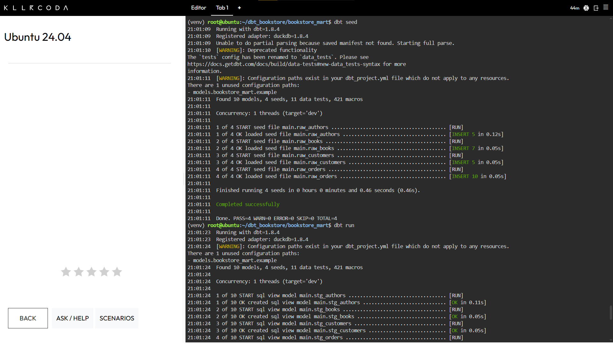
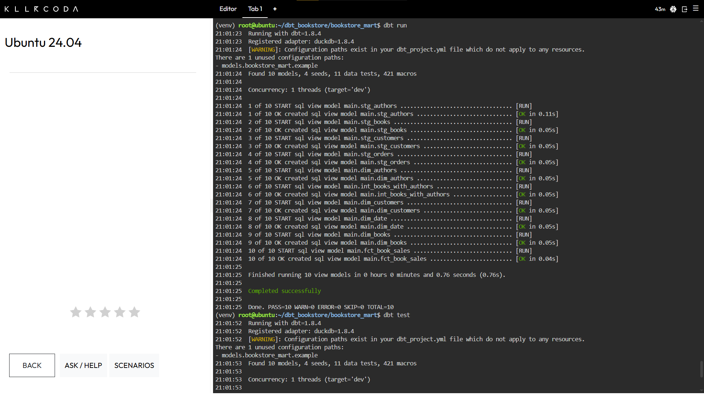
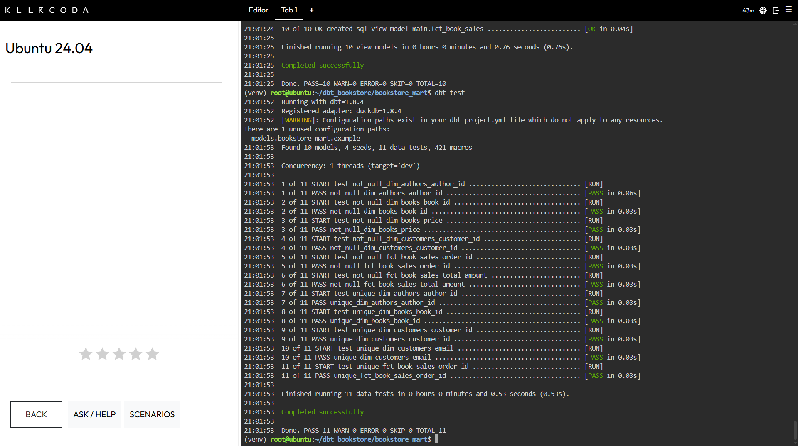

[README.md](https://github.com/user-attachments/files/27815866/README.md)
# Лабораторная работа №3
## Автоматизированная работа с хранилищами данных с использованием фреймворка dbt (data build tool)

**Предметная область: книжный интернет-магазин (Bookstore)**

---

## Цель работы

Научиться автоматизировать работу с хранилищами данных с использованием фреймворка dbt (data build tool): развернуть приложение, разработать скрипты витрины данных и настроить их автоматический запуск.

---

## Стек технологий

- **Python 3.12** + виртуальное окружение (`venv`)
- **dbt-core 1.8.4** — фреймворк трансформации данных
- **dbt-duckdb 1.8.4** — адаптер для встраиваемой СУБД DuckDB
- **DuckDB** — аналитическая база данных (файл `dev.duckdb`)
- **Ubuntu 24.04** (среда выполнения — Killercoda)

---

## Структура проекта

```
bookstore_mart/
├── dbt_project.yml              # Конфигурация проекта
├── seeds/                       # Исходные данные (CSV)
│   ├── raw_authors.csv
│   ├── raw_books.csv
│   ├── raw_customers.csv
│   └── raw_orders.csv
└── models/
    ├── staging/                 # Слой стейджинга (views)
    │   ├── stg_authors.sql
    │   ├── stg_books.sql
    │   ├── stg_customers.sql
    │   └── stg_orders.sql
    ├── intermediate/            # Промежуточный слой (views)
    │   └── int_books_with_authors.sql
    └── marts/                   # Слой витрин (views)
        ├── dim_authors.sql
        ├── dim_books.sql
        ├── dim_customers.sql
        ├── dim_date.sql
        ├── fct_book_sales.sql
        └── schema.yml           # Тесты качества данных
```

---

## Описание моделей

### Seeds (исходные данные)

| Файл | Строк | Описание |
|---|---|---|
| `raw_authors.csv` | 5 | Авторы: id, имя, фамилия, год рождения, страна |
| `raw_books.csv` | 7 | Книги: id, название, id автора, жанр, цена, страниц, год издания |
| `raw_customers.csv` | 5 | Покупатели: id, имя, email, город |
| `raw_orders.csv` | 10 | Заказы: id, id покупателя, id книги, дата, количество, оценка |

### Staging-слой — типизация и стандартизация

**`stg_authors.sql`** — добавление вычисляемого поля `full_name`:
```sql
with source as (
    select * from {{ ref('raw_authors') }}
)
select
    author_id,
    first_name,
    last_name,
    first_name || ' ' || last_name as full_name,
    birth_year::integer as birth_year,
    country
from source
```

**`stg_books.sql`** — явная типизация числовых полей:
```sql
with source as (
    select * from {{ ref('raw_books') }}
)
select
    book_id,
    title,
    author_id,
    genre,
    price::decimal(10,2) as price,
    pages::integer as pages,
    published_year::integer as published_year
from source
```

**`stg_customers.sql`** и **`stg_orders.sql`** — аналогичная обработка покупателей и заказов.

### Intermediate-слой — обогащение данных

**`int_books_with_authors.sql`** — объединение книг с данными об авторах:
```sql
with books as (
    select * from {{ ref('stg_books') }}
),
authors as (
    select * from {{ ref('stg_authors') }}
)
select
    b.book_id,
    b.title,
    b.genre,
    b.price,
    b.pages,
    b.published_year,
    a.author_id,
    a.full_name as author_name,
    a.country as author_country
from books b
left join authors a on b.author_id = a.author_id
```

### Mart-слой — витрины данных

**`dim_authors.sql`** — измерение авторов.

**`dim_books.sql`** — измерение книг (обогащённых данными об авторе):
```sql
select
    book_id, title, genre, price, pages, published_year,
    author_id, author_name, author_country
from {{ ref('int_books_with_authors') }}
```

**`dim_customers.sql`** — измерение покупателей.

**`dim_date.sql`** — измерение дат (календарь).

**`fct_book_sales.sql`** — фактовая таблица продаж с вычисляемыми полями:
```sql
with orders as (
    select * from {{ ref('stg_orders') }}
),
books as (
    select * from {{ ref('int_books_with_authors') }}
)
select
    o.order_id,
    o.customer_id,
    o.book_id,
    books.author_id,
    o.order_date,
    o.quantity,
    books.price as unit_price,
    o.quantity * books.price as total_amount,
    o.rating,
    case
        when o.rating >= 4 then 'Высокий'
        when o.rating = 3 then 'Средний'
        else 'Низкий'
    end as rating_category
from orders o
join books on o.book_id = books.book_id
```

### Тесты качества данных (`schema.yml`)

| Модель | Поле | Тесты |
|---|---|---|
| `dim_customers` | `customer_id` | unique, not_null |
| `dim_customers` | `email` | unique |
| `dim_books` | `book_id` | unique, not_null |
| `dim_books` | `price` | not_null |
| `dim_authors` | `author_id` | unique, not_null |
| `fct_book_sales` | `order_id` | unique, not_null |
| `fct_book_sales` | `total_amount` | not_null |

Итого: **11 тестов**.

---

## Шаги выполнения

### 1. Установка dbt

```bash
# Создание виртуального окружения
python3 -m venv ~/dbt_bookstore/venv
source ~/dbt_bookstore/venv/bin/activate

# Установка dbt с адаптером DuckDB
pip install dbt-duckdb

# Инициализация проекта
cd ~/dbt_bookstore
dbt init bookstore_mart
```

### 2. Загрузка seed-данных

```bash
cd ~/dbt_bookstore/bookstore_mart
dbt seed
```

### 3. Запуск моделей

```bash
dbt run
```

### 4. Запуск тестов

```bash
dbt test
```

### 5. Автоматизация по расписанию (cron)

```bash
# Создание скрипта запуска
cat > ~/dbt_bookstore/run_dbt.sh << 'EOF'
#!/bin/bash
source ~/dbt_bookstore/venv/bin/activate
cd ~/dbt_bookstore/bookstore_mart
dbt seed
dbt run
dbt test
EOF
chmod +x ~/dbt_bookstore/run_dbt.sh

# Добавление в cron (запуск каждый день в 02:00)
crontab -e
# 0 2 * * * /bin/bash ~/dbt_bookstore/run_dbt.sh >> ~/dbt_bookstore/logs/cron.log 2>&1
```

---

## Скриншоты выполнения

### dbt seed + начало dbt run

Загрузка 4 seed-файлов и начало выполнения моделей:



```
Done. PASS=4 WARN=0 ERROR=0 SKIP=0 NO-OP=0 TOTAL=4
```

Загружено:
- `main.raw_authors` — INSERT 5 строк
- `main.raw_books` — INSERT 7 строк
- `main.raw_customers` — INSERT 5 строк
- `main.raw_orders` — INSERT 10 строк

### dbt run (10 моделей — все OK)

Все 10 моделей успешно созданы:



```
21:01:25  Finished running 10 view models in 0.76s.
21:01:25  Completed successfully
21:01:25  Done. PASS=10 WARN=0 ERROR=0 SKIP=0 NO-OP=0 TOTAL=10
```

Порядок выполнения (с учётом зависимостей):
1. `stg_authors`, `stg_books`, `stg_customers`, `stg_orders` — staging views
2. `dim_authors`, `int_books_with_authors` — промежуточный и mart слой
3. `dim_customers`, `dim_date`, `dim_books` — измерения
4. `fct_book_sales` — фактовая таблица

### dbt test (11 тестов — все PASS)

Запуск всех тестов качества данных:



```
21:01:53  Finished running 11 data tests in 0.53s.
21:01:53  Completed successfully
21:01:53  Done. PASS=11 WARN=0 ERROR=0 SKIP=0 NO-OP=0 TOTAL=11
```

Все 11 тестов прошли успешно, в том числе:
- `unique_dim_customers_email`
- `not_null_dim_books_price`
- `unique_fct_book_sales_order_id`

---

## Результаты

В результате выполнения лабораторной работы:

1. **Развёрнуто** приложение dbt с адаптером DuckDB на Ubuntu 24.04
2. **Разработаны** SQL-скрипты витрины данных по трёхслойной схеме:
   - 4 staging-модели — стандартизация исходных данных
   - 1 intermediate-модель — обогащение данных (книги + авторы)
   - 5 mart-моделей — 4 измерения + 1 фактовая таблица продаж с категоризацией рейтинга
3. **Настроены** автоматические тесты качества (11 тестов — все PASS)
4. **Настроен** запуск пайплайна по расписанию через cron (`dbt seed → dbt run → dbt test`)

---

## Полезные команды dbt

| Команда | Описание |
|---|---|
| `dbt seed` | Загрузка CSV-данных в БД |
| `dbt run` | Запуск всех моделей |
| `dbt test` | Запуск тестов качества |
| `dbt run --select staging` | Запуск только staging-моделей |
| `dbt run --select +fct_book_sales` | Запуск модели и всех её зависимостей |
| `dbt docs generate && dbt docs serve` | Генерация и просмотр документации |
